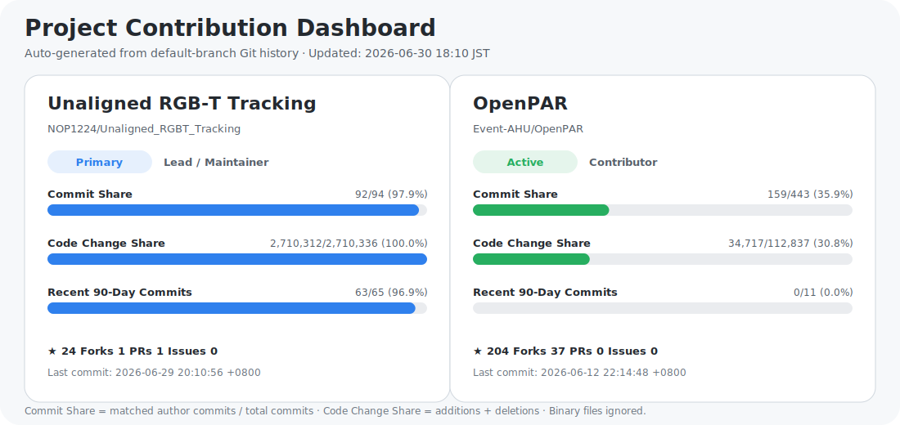

<h1 align="center">Jiandong Jin</h1>

  Ph.D. Student · Anhui University  
   
  Unaligned RGB-T Tracking · Multimodal Tracking · Image Matching & Registration · Pedestrian Attribute Recognition

  <a href="https://github.com/NOP1224/Unaligned_RGBT_Tracking">Unaligned RGB-T Tracking</a>
  ·
  <a href="https://github.com/Event-AHU/OpenPAR">OpenPAR</a>

---

  

---

## Focus

`Unaligned RGB-T Tracking` · `Multimodal Alignment` · `Image Registration` · `Pedestrian Attribute Recognition`

## Projects

- [**Unaligned_RGBT_Tracking**](https://github.com/NOP1224/Unaligned_RGBT_Tracking): benchmark, dataset, toolkit, baselines, and alignment-aware RGB-T tracking.
- [**OpenPAR**](https://github.com/Event-AHU/OpenPAR): open-source pedestrian attribute recognition framework and related experiments.
